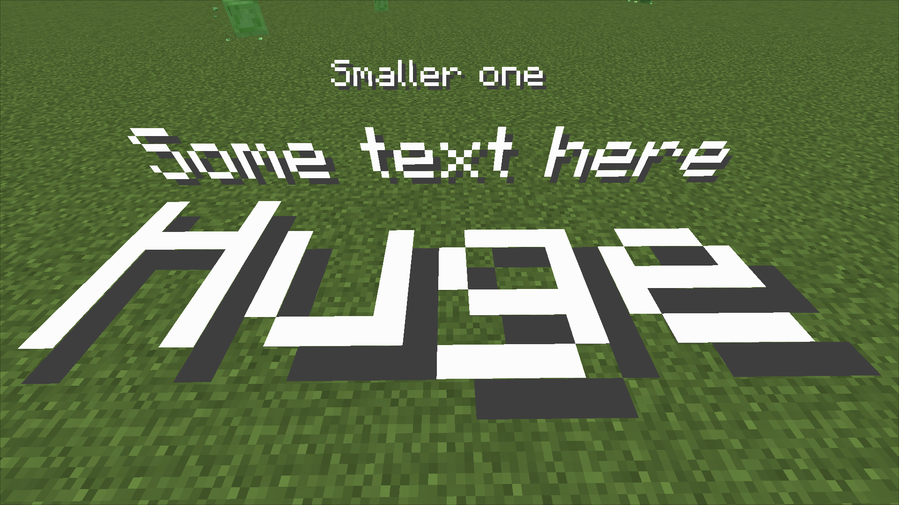

Credits to original author of the mod [GitWither](https://github.com/GitWither).

**Changes in this fork:**
- Fixed few bugs related to rendering.
- Ported mod to 1.19.4.
- Added `ctrl+<Scroll>` mapping to easily change font size.
- Align placed blocks automatically.
- Moved text block item to redstone category.

## Where is item?

Here.

## How does it look like?

## Interface

